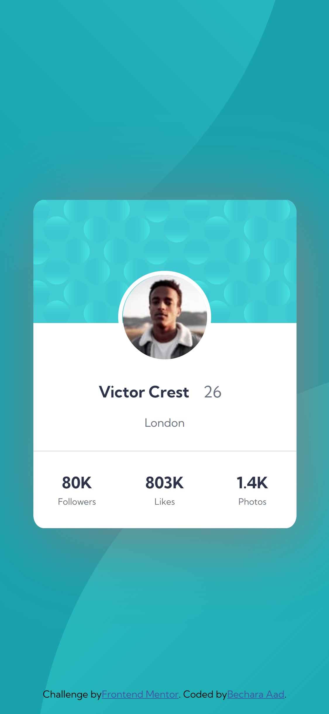

# Frontend Mentor - Profile card component solution

This is a solution to the [Profile card component challenge on Frontend Mentor](https://www.frontendmentor.io/challenges/profile-card-component-cfArpWshJ). Frontend Mentor challenges help you improve your coding skills by building realistic projects.

## Table of contents

- [The challenge](#the-challenge)
- [Screenshot](#screenshot)
- [Links](#links)
- [My process](#my-process)
- [Built with](#built-with)
- [What I learned](#what-i-learned)
- [Continued development](#continued-development)
- [Useful resources](#useful-resources)
- [Author](#author)

## Overview

### The challenge

- Build out the project to the designs provided

### Screenshot




### Links

- Solution URL: [https://github.com/Bechara-Aad/Profile-card-component.git]
- Live Site URL: [https://gracious-morse-242e51.netlify.app]

## My process

-Create intial repository commit to Git and link local repository to Github
-Breakdown the project into components
-Figure out how to built each component seperately using HTML/CSS with a mobile 1st approch
-Assemble the different components in the mobile form
-adapt the designs to fit wider screens and desktop, by adding the necessary code
-Run html/CSS file through W3 official validators, to look for any errors
-Make sure to make the last commit/ push to Github before hosting the site (ex. for free on Netlify)

### Built with

- HTML5
- CSS3
- Mobile-first approach

### What I learned

A major learning during this challenge was coding for backrounds that fit different screen sizes/devices, by using and manipulating the CSS backround properties, as per the code example below

```css
body {
  background-image: url(/images/bg-pattern-top.svg),
    url(/images/bg-pattern-bottom.svg);
  background-repeat: no-repeat, no-repeat;
  background-position: top -40rem left -40rem, bottom -35rem right -40rem;
}

### Continued development

I wish to calcify my CSS skills particularly through the use of Grids and flexbox in future challenging exercises.

### Useful resources

-(https://www.youtube.com/watch?v=3T_Jy1CqH9k) - This video tutorial by Kevin Powell helped me in understanding how to manipulate the backgrounds specfically in dynimcally designed websites.

## Author

- Frontend Mentor - [@Bechara-Aad] frontendmentor.io/profile/Bechara-Aad)
- Github - [https://github.com/Bechara-Aad]
```

---
